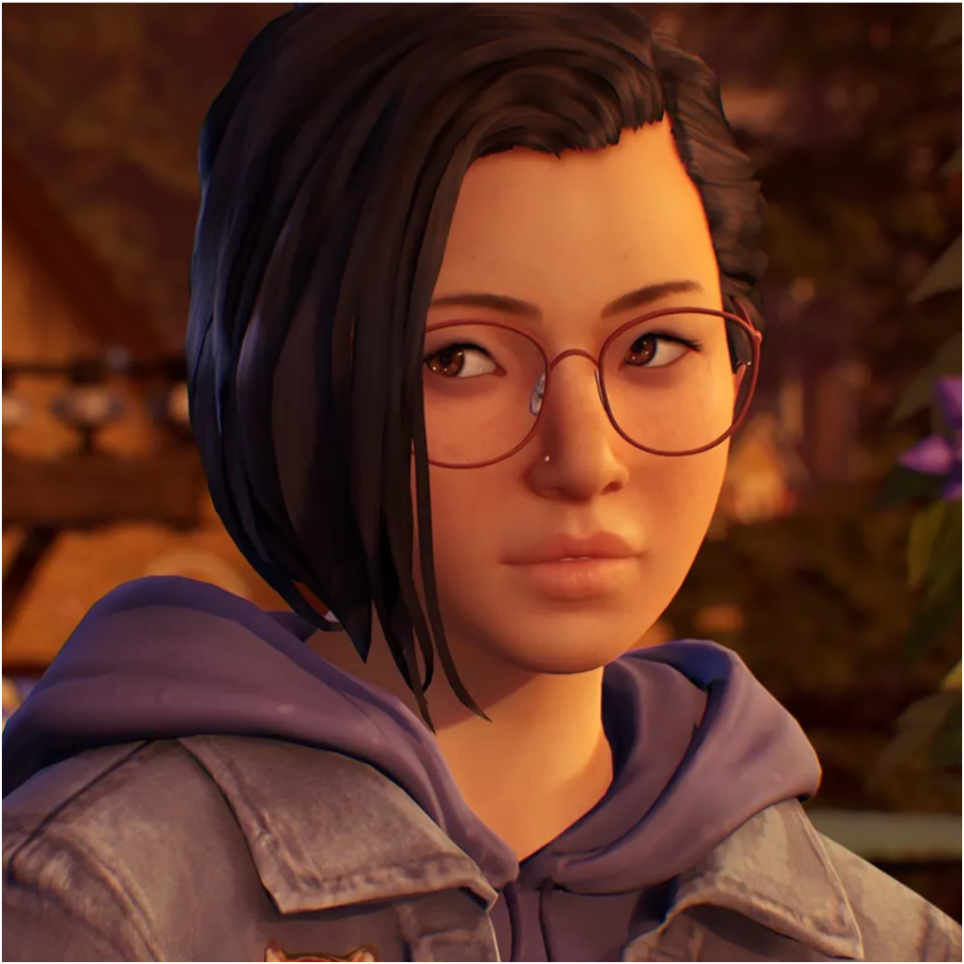

<!--
*** Thanks for checking out the Dark-LYNN's README.
*** Here i will upload my things that actualy are about anything.
*** Thanks again!
-->

<!-- PROJECT SHIELDS -->
<!--
*** I'm using markdown "reference style" links for readability.
*** https://www.markdownguide.org/basic-syntax/#reference-style-links
-->
<!-- PROJECT LOGO -->
 

  

  <h3 align="center">Dark-LYNN</h3>

  

    Welcome to my awsome github page!
     
    <a href="https://github.com/othneildrew/Best-README-Template"><strong>Explore the docs »</strong></a>
     
     
    <a href="https://github.com/othneildrew/Best-README-Template">Markdown</a>
    ·
    <a href="https://github.com/othneildrew/Best-README-Template/issues">Report Bug</a>
    ·
    <a href="https://github.com/othneildrew/Best-README-Template/issues">Request Feature</a>
  

### Code languages:

### About me:
- 😄 Pronouns: `She/Her`
- 📫 How to reach me: [Email Me](https://mail.google.com/mail/?view=cm&fs=1&to=botdevlynn@gmail.com&su=[contact%20using%20github]&body=BODY)
<!--
- 🔭 I’m currently working on a [discord bot](https://discord.com/api/oauth2/authorize?client_id=738057910923296839&permissions=8&redirect_uri=https%3A%2F%2Fdiscord.gg%2Ffe3pwwW6Q5&response_type=code&scope=guilds.join%20bot)
- 🌱 I’m currently learning ...
- 👯 I’m looking to collaborate on ...
- 🤔 I’m looking for help with ...
- 💬 Ask me about ...
- 📫 How to reach me: ...
- ⚡ Fun fact: ...
-->

### Other Links:

